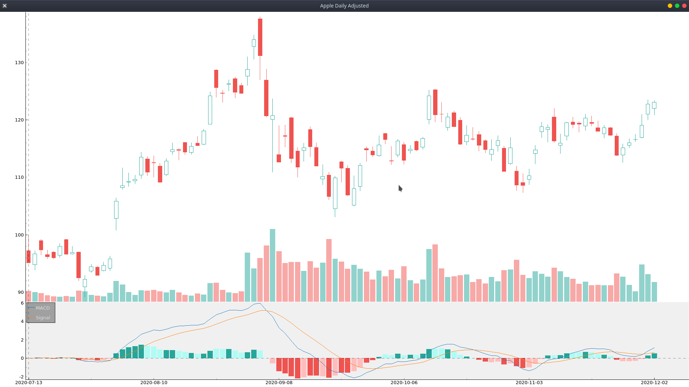
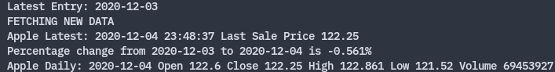

# stocksCandlestick

## Overview
Get data from AlphaVantage and IEXCloud public apis about stocks, indexes etc.. 
Create candlestick plot with macd from data. 
Daily data is stored in sqlite3 database.

## How to use 
* Install packages listed in requirement.txt (some kind of virtual environment recommended)
* Create /db in base dir. 
* Run the setupdb.py to create a sqlite database with tables for apple, microsoft and snp500 etf.(last 100 days of data) 
* Database will be in /db.
* Running apple.py, microsoft.py or snp500.py in src will update its data, print out last daily entry and print latest data about stock sale price from IEXCloud.

## How to add other stocks
In theory any stock available from AlphaVantage and IEXCloud should be easy to add, you need:
  * A stock object, for example:
  ``` apple = stock("Apple", "AAPL", "apple_daily_adjusted") ```
  * A database table for the stock, can be achieved by adding to setupdb.py or manually adding it to the db.
  * A python program that creates a stock object and uses its methods.

All the common requirements for updating, getting data and plotting is contained in the stock class. 
apple.py, microsoft.py or snp500.py are examples of how to use the stock class.

### Potential issue with adding stocks
Some stocks have undergone stock splits or other such disruptions, whilst AlphaVantage provides adjusted closing prices, the other values are unadjusted. 
This means that data may have to be adjusted. (See setupdb.py for apple's table in the db)

## Examples





## OS Support
Paths in the examples apple.py etc... are for a linux filesystem.
Adjust for your own OS accordingly.

## Disclaimer 
This is intended for non-commerical use.
Data attributed to AlphaVantage and IEXCloud.
